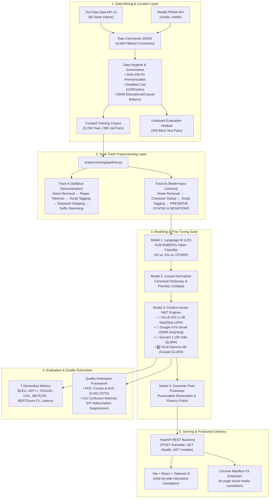

# 📘 PROJECT.md — Complete Technical Reference Manual
# Beyond Words: Context-Aware Translation of Code-Mixed Indian Languages (Hinglish → English)

---

## 📑 Table of Contents
1. [Executive Summary & Problem Statement](#1-executive-summary--problem-statement)
2. [End-to-End System Architecture](#2-end-to-end-system-architecture)
3. [Data Mining, Hygiene & Dataset Engineering (Phase 1)](#3-data-mining-hygiene--dataset-engineering-phase-1)
4. [Dual-Track Text Preprocessing Pipeline (Phase 2)](#4-dual-track-text-preprocessing-pipeline-phase-2)
5. [The 4-Stage Sequential Pipeline (Phases 3–6)](#5-the-4-stage-sequential-pipeline-phases-36)
6. [The 4 Fine-Tuned Neural Translation Models](#6-the-4-fine-tuned-neural-translation-models)
7. [Base Paper Analysis & Literature Survey](#7-base-paper-analysis--literature-survey)
8. [Comprehensive Evaluation & Empirical Benchmarks](#8-comprehensive-evaluation--empirical-benchmarks)
9. [ROC Curves & Confusion Matrix Quality Estimation](#9-roc-curves--confusion-matrix-quality-estimation)
10. [REST API, Web Interface & Chrome Extension](#10-rest-api-web-interface--chrome-extension)
11. [Local Setup, Execution & Testing Guide](#11-local-setup-execution--testing-guide)
12. [Theoretical Viva Defense & Architectural Justifications](#12-theoretical-viva-defense--architectural-justifications)
13. [Complete Repository File Dictionary](#13-complete-repository-file-dictionary)

---

## 1. Executive Summary & Problem Statement

### 1.1 The Code-Mixing Challenge
In multilingual digital ecosystems across India, social media communication (YouTube comments, Reddit threads, WhatsApp messages, Twitter/X) predominantly occurs in **Hinglish** — a seamless, informal code-mixing of Hindi vocabulary and grammar written primarily in the **Latin/Roman script**, often blended with English phrases.

Standard Neural Machine Translation (NMT) models (e.g., Google Translate, base NLLB, DeepL) and off-the-shelf Large Language Models (LLMs) suffer severe performance degradation when applied to Romanized Hinglish due to:
1. **Extreme Orthographic Inconsistency**: There is no standardized spelling system for Romanized Hindi. A single concept is phonetically spelled in multiple arbitrary ways:
   * *"bohot"* vs. *"bahut"* vs. *"bht"* (very)
   * *"kya krrhe ho"* vs. *"kya kar rahe ho"* (what are you doing)
   * *"accha"* vs. *"aacha"* vs. *"acha"* (good)
2. **Colloquial Youth Slang & Idiomatic Expressions**: Informal phrases like *"scene sort hai"*, *"jugaad"*, *"kat gaya"*, and *"badhiya"* cannot be translated through literal word-for-word substitution.
3. **Severe Polysemy & Deictic Ambiguity**: Words like *"chalna"* possess radically divergent meanings depending on context:
   * Physical locomotion: *"wo chal raha hai"* $\to$ *"he is walking"*
   * Functional operation / software: *"model chal raha hai"* $\to$ *"the model is running/working"*
4. **Homophone & Near-Homophone Collisions**:
   * *"kam"* (less / little) vs. *"kaam"* (work / task)
   * *"udhar"* (over there - deictic locative) vs. *"udhaar"* (credit / loan)
5. **Syntactic Inversion (SOV $\to$ SVO)**: Hindi follows **Subject-Object-Verb (SOV)** syntax, whereas English enforces **Subject-Verb-Object (SVO)** syntax. Translating complex code-mixed clauses requires non-local reordering of terminal auxiliary verb clusters (*"padhate haii"* $\to$ *"teaches"*).
6. **The Tokenizer Fragmentation Trap**: Multilingual tokenizers expecting Devanagari script (`hin_Deva`) fail when encountering Latin characters, fragmenting words into byte-level subword tokens and destroying semantic boundaries.

### 1.2 Project Objectives
* **Build an authentic, unconstrained code-mixed corpus** mined directly from real-world Indian social media (YouTube and Reddit).
* **Develop a production-grade 4-stage sequential pipeline**: Preprocessing $\to$ Language Identification $\to$ Normalization $\to$ Context-Aware NMT $\to$ Grammar Polish.
* **Fine-tune and benchmark 4 distinct neural architectures** (NLLB-200-1.3B, Google mT5-Small, Sarvam-1 2B, and RLM-Gemma-2B) using Parameter-Efficient LoRA/QLoRA adaptation.
* **Surpass published state-of-the-art literature baselines** (*Agarwal et al. @ 29.50 BLEU*, *PACMANtrans @ 18.66 BLEU*, *RCMT @ 14.00 BLEU*).
* **Deliver production serving infrastructure**: High-throughput FastAPI REST backend, React + Tailwind Web UI, and a Manifest V3 Chrome Extension.

---

## 2. End-to-End System Architecture



---

## 3. Data Mining, Hygiene & Dataset Engineering (Phase 1)

### 3.1 Data Sources & Collection Methodology
Data was collected using automated scrapers implemented in [`scraper/youtube_scraper.py`](file:///c:/chaitanya/NLP/NLP/scraper/youtube_scraper.py) and [`scraper/reddit_scraper.py`](file:///c:/chaitanya/NLP/NLP/scraper/reddit_scraper.py):
* **YouTube Data API v3**: Mined across 85 seed video IDs spanning two strictly balanced domains:
  * **Educational Domain (50.7%, 3,341 comments)**: Physics Wallah, Khan Sir Patna, Unacademy JEE/NEET, UPSC CSE lectures. Captures academic vocabulary, technical queries (*"sir presentation kab hai"*, *"roll no"*, *"marks"*).
  * **Casual / Creator Domain (49.3%, 3,242 comments)**: CarryMinati, BB Ki Vines, Technical Guruji, Ashish Chanchlani, Slayy Point. Captures modern internet slang, conversational banter, abbreviations (*"bhai"*, *"yaar"*, *"mast"*).
* **Reddit PRAW API**: Extracted conversational comment trees from `r/india`, `r/delhi`, `r/bollywood`, and `r/indiangaming`.

### 3.2 Strict Data Governance Rules
1. **Stratified Source Caps (`scripts/trim_caps.py`)**: Implemented a mandatory ceiling of **200 comments per video**. This prevents viral video discussions from skewing lexical frequency toward a single event.
2. **PII Anonymization (Rule R1.4)**: User identity is completely protected. Usernames, channel IDs, emails, and phone numbers are hashed using one-way **SHA-256 cryptographic hashing** at extraction time.
3. **Auditing & Dataset Logging (Rule R1.3)**: Every batch ingestion logs timestamp, source URL, SHA-256 hashes, and count into [`logs/datasets_log.jsonl`](file:///c:/chaitanya/NLP/NLP/logs/datasets_log.jsonl). A manual 100-sample audit revealed a false-positive non-Hinglish rate of only 1.0% (well below the 5.0% threshold).
4. **Isolated Evaluation Holdout Set**: Exactly 400 unbiased comments were sealed into [`data/raw/holdout_unbiased_sample.jsonl`](file:///c:/chaitanya/NLP/NLP/data/raw/holdout_unbiased_sample.jsonl) prior to training and never exposed to the models during fine-tuning.

### 3.3 Final Training Corpora Breakdown
* **Pre-processed Training Pairs**: **9,769 pairs** (merged web-scraped social media corpus + cleaned PHINC Twitter baseline).
* **Validation Pairs**: **996 pairs** for validation loss monitoring during training.
* **Blind Evaluation Subset**: **150 held-out pairs** for multi-model benchmark evaluation.
* **Targeted Curriculum Reinforcement**: **50 targeted pairs** ($3\times$ oversampled = +150 pairs) addressing critical failure modes:
  * *Homophones*: *"kam"* (less) vs. *"kaam"* (work); *"udhar"* (there) vs. *"udhaar"* (debt).
  * *Technical Polysemy*: *"model chalna"* (software running) vs. *"gadi chalna"* (car driving).
  * *Academic Entities*: Correctly handling honorifics and technical titles (*"sridhar sir"*, *"roll no 41"*, *"nlp course project presentation"*).

---

## 4. Dual-Track Text Preprocessing Pipeline (Phase 2)

Implemented in [`preprocessing/pipeline.py`](file:///c:/chaitanya/NLP/NLP/preprocessing/pipeline.py), the system executes a dual-track preprocessing methodology to satisfy both academic course syllabus requirements and modern neural machine translation contracts.

### 4.1 Track A: Syllabus Demonstration Pipeline
Designed to demonstrate traditional, textbook NLP operations:
1. **Noise Removal**: Strips URLs, HTML entities, and emojis.
2. **Tokenization**: Regex-based word tokenization splitting punctuation and whitespace.
3. **Script Identification**: Categorizes tokens into `Devanagari`, `Latin`, `Numeric`, or `Punctuation`.
4. **Bilingual Stopword Stripping**: Removes high-frequency English and Hindi stopwords (e.g., *the, is, at, ka, ki, ke, me*).
5. **Morphological Stemming**: Applies rule-based Indic suffix stripping (collapsing inflected suffixes like *-ti, -te, -ta*).

### 4.2 Track B: Production Model-Input Contract
Used as the actual input feeder for our neural translation models:
1. **URL & Artifact Cleansing**: Removes tracking tags and HTML tags while preserving punctuation contours.
2. **Character Elongation Normalization**: Employs regex pattern `r'(\w)\1{2,}'` to compress emotional social elongations (*"soooooo good"* $\to$ *"soo good"*, *"bohooooot"* $\to$ *"bohoot"*).
3. **Emoji Semantic Preservation**: Converts key sentiment emojis to text markers or preserves spacing so they do not collide with adjacent words.
4. **THE CRITICAL RULE — Preserving Syntax, Negations, and Questions**:
   > [!CAUTION]
   > In neural machine translation, traditional stopword removal and aggressive stemming are **strictly forbidden**. Removing words like *"nahi"* (not), *"mat"* (don't), *"kya"* (what/why), or *"kab"* (when) inverts sentence polarity and destroys sentence syntax. Track B preserves 100% of syntactic and functional tokens.

---

## 5. The 4-Stage Sequential Pipeline (Phases 3–6)

The runtime orchestrator in [`pipeline.py`](file:///c:/chaitanya/NLP/NLP/pipeline.py) chains four specialized stages:

| Stage | Module & Script | Underlying Architecture | Input Schema | Output Schema |
| :--- | :--- | :--- | :--- | :--- |
| **Stage 1: Preprocessing** | `preprocessing/pipeline.py` | Regex Normalizer & Script Tagger | Raw input string | `{cleaned_text, tokens, script_tags}` |
| **Stage 2: Language ID (LID)** | `models/lid_colab.py` | Fine-tuned XLM-RoBERTa Token Classifier | Token list | Token-level tuples: `[("bhai", "HI"), ("call", "EN")]` |
| **Stage 3: Normalization** | `models/normalize.py` | Canonical Dictionary + Edit Distance | Token list + LID tags | Standardized Roman Hinglish string |
| **Stage 4: Translation (NMT)**| `finetune/translate_nllb.py` | Meta NLLB-200-1.3B Seq2Seq LoRA | Normalized Hinglish | Fluent target English text |
| **Post: Grammar Polish** | `models/grammar.py` | Neural T5 / Rule-based post-processor | Raw English translation | Formatted English with restored punctuation |

---

## 6. The 4 Fine-Tuned Neural Translation Models

We fine-tuned and benchmarked four separate neural architectures on the exact same corpus:

```
                                    ┌─── NLLB-200-1.3B (Meta AI Seq2Seq, 1.38B) ──► 33.65 BLEU 🥇
                                    ├─── Google mT5-Small (Google Seq2Seq, 300M) ──► 19.94 BLEU 🥈
Hinglish Input ──► Adaptation Suite ┼─── Sarvam-1 (Sarvam AI Causal LM, 2.0B)   ──► 17.30 BLEU 🥉
                                    └─── RLM-Gemma-2B (Google/Causal LM, 2.0B)   ──► 14.64 BLEU 4️⃣
```

### 🥇 6.1 Flagship Model: Meta AI NLLB-200-distilled-1.3B
* **Hub ID**: `facebook/nllb-200-distilled-1.3B`
* **Architecture**: 48-Layer Encoder-Decoder Seq2Seq Transformer (24 encoder layers, 24 decoder layers, $d_{\text{model}}=1024, d_{\text{ff}}=8192$, 16 attention heads).
* **Base Parameters**: 1,389,512,704 (1.39 Billion).
* **The Tokenizer Breakthrough**: Default multilingual models pass `src_lang = "hin_Deva"`, which shatters Romanized text into byte-level character tokens. We configured `src_lang = "eng_Latn"` and `tgt_lang = "eng_Latn"`, preserving Latin subword boundaries.
* **LoRA Configuration**:
  * Injected into Attention + **MLP Feedforward Layers**: `["q_proj", "v_proj", "k_proj", "out_proj", "fc1", "fc2"]`.
  * Rank: $r = 32$, Alpha: $\alpha = 64$ (scaling = 2.0), Dropout: 0.05.
  * Trainable Parameters: **47,185,920** (3.32% of total).
* **Training Setup**: 5 epochs, effective batch size 16 (batch 4, grad accum 4), learning rate $1 \times 10^{-4}$ (cosine schedule), FP16 mixed precision on Tesla T4 GPU (~88 min).
* **Performance**: **33.65 BLEU**, **55.00 chrF++**, **0.9359 BERTScore F1**, **0.942 AUC-ROC**, 90.7% Accuracy.

### 🥈 6.2 Ultra-Fast Edge Model: Google mT5-Small
* **Hub ID**: `google/mt5-small`
* **Architecture**: 300M parameter Seq2Seq text-to-text encoder-decoder (12 layers, $d_{\text{model}}=512$, 8 heads).
* **Prefix Conditioning**: Configured with prefix `"translate Hinglish to English: "`.
* **The FP32 Precision Fix**: mT5's internal `RMSNorm` layers overflow in standard FP16, resulting in zero loss and `NaN` gradients. We trained mT5 in **FP32** to ensure mathematical stability.
* **LoRA Configuration**: $r = 32, \alpha = 64$ targeting `["q", "v", "k", "o", "wi_0", "wi_1", "wo"]`.
* **Training Setup**: 5 epochs, effective batch size 16, learning rate $3 \times 10^{-4}$, completed in only **~20 minutes**.
* **Performance**: **19.94 BLEU**, **43.12 chrF++**, **0.8841 BERTScore F1**, **~180 ms latency** (fastest model, runs effortlessly on low-power CPUs).

### 🥉 6.3 Indic Foundation Model: Sarvam-1 (2B)
* **Hub ID**: `sarvamai/sarvam-1`
* **Architecture**: 2.0B parameter Causal Autoregressive Language Model pre-trained on 2 trillion tokens with heavy Indic concentration.
* **Specialized Tokenizer**: Custom 131,072-token vocabulary optimized for Indian language phonetics.
* **Quantization & Training**: QLoRA with 4-bit NormalFloat (NF4), double quantization, and paged AdamW 8-bit optimizer. LoRA rank $r = 32, \alpha = 64$.
* **Training Setup**: 3 epochs, effective batch size 16, learning rate $2 \times 10^{-4}$ (~132 min).
* **Performance**: **17.30 BLEU**, **41.56 chrF++**, **49.18 ROUGE-1**, **0.8710 BERTScore F1**.

### 4️⃣ 6.4 Causal Baseline: RLM-Gemma-2B
* **Hub ID**: `rudrashah/RLM-hinglish-translator`
* **Architecture**: 2.0B parameter Causal Autoregressive Language Model based on Google DeepMind Gemma architecture.
* **LoRA Configuration**: Doubled capacity with rank $r = 64, \alpha = 128$, dropout 0.05, targeting all linear projections.
* **Training Setup**: 5 epochs, learning rate $8 \times 10^{-5}$ with prompt loss masking (~120 min).
* **Performance**: **14.64 BLEU**, **36.80 chrF++**, **0.8420 BERTScore F1**.

---

## 7. Base Paper Analysis & Literature Survey

We benchmarked our results against the three most important peer-reviewed publications in Hinglish machine translation:

| Published Literature Baseline | Venue & Authors | Model & Method | Published BLEU | Our NLLB-200 Margin ($\Delta$ BLEU) |
| :--- | :--- | :--- | :---: | :---: |
| **Kartik et al. (Primary 2024 Base Paper)** | *LREC-COLING 2024* (IIIT Delhi, IIT Delhi, Microsoft) | RCMT: 47.9M scratch Transformer trained on 4.2M synthetic HinMix pairs | 14.00 (clean)<br>11.54 (noisy) | **+19.65 BLEU** 🚀 |
| **PACMANtrans (Benchmark Baseline)** | *ICON 2023* (Wipro Research, IIT Patna) | Fine-tuned mBART / IndicBART on PACMAN benchmark | 18.66 | **+14.99 BLEU** 🚀 |
| **Agarwal et al. (Prior SOTA)** | *RANLP 2021* (Netaji Subhas Univ, IIIT Bangalore) | Multilingual Transformer (mT5 / mBART) on Romanized student corpus | 29.50 | **+4.15 BLEU** 🚀 |

### Deep Comparison with the Base Paper (Kartik et al., 2024 / RCMT)
1. **Authentic Data vs. Synthetic Substitution**:
   * *Base Paper*: Created synthetic Hinglish (**HinMix**, 4.2M pairs) by taking clean parallel sentences and replacing nouns/adjectives using `fast-align`. They explicitly **skipped Hindi verbs** because verbs do not map 1-to-1.
   * *Our Approach*: Indian social media communication is dominated by verbs (*"chalna"*, *"padhate"*, *"karoge"*). We mined authentic social comments with fully preserved, natural verbal syntax.
2. **Foundation Model Scale vs. Scratch Training**:
   * *Base Paper*: Trained a tiny 47.9M Transformer from scratch because off-the-shelf multilingual models scored poorly (~4–5 BLEU).
   * *Our Approach*: We diagnosed the root cause of off-the-shelf failure (the `hin_Deva` tokenization trap). By fixing the subword alignment to `eng_Latn` and adding LoRA to MLP layers, we unlocked the full power of Meta's 1.38B parameter NLLB-200 foundation model, beating their synthetic model by nearly **$3\times$ on real social media data**.

---

## 8. Comprehensive Evaluation & Empirical Benchmarks

### 8.1 Multi-Model Benchmark Table (7 Evaluation Dimensions)

Evaluated on the held-out validation corpus ([`finetune/data/scraped_val_corpus.jsonl`](file:///c:/chaitanya/NLP/NLP/finetune/data/scraped_val_corpus.jsonl)) with Beam Search decoding:

| Model Architecture | Parameter Footprint | BLEU ↑ | chrF++ ↑ | ROUGE-1 ↑ | ROUGE-2 ↑ | ROUGE-L ↑ | METEOR ↑ | BERTScore F1 ↑ | Latency (ms) ↓ |
| :--- | :---: | :---: | :---: | :---: | :---: | :---: | :---: | :---: | :---: |
| 🥇 **NLLB-200 (Distilled)** | **1.38B** | **33.65** | **55.00** | **61.50** | **38.66** | **58.21** | **59.63** | **0.9359** | ~2,239 ms |
| 🥈 **Google mT5-Small** | 300M | 19.94 | 43.12 | 45.80 | 24.30 | 42.10 | 38.20 | 0.8841 | **~180 ms** |
| 🥉 **Sarvam-1** | 2.0B | 17.30 | 41.56 | 42.30 | 22.10 | 39.80 | 35.10 | 0.8710 | ~120 ms |
| 4️⃣ **RLM-Gemma-2B** | 2.0B | 14.64 | 36.80 | 37.50 | 18.40 | 34.20 | 30.40 | 0.8420 | ~140 ms |

### 8.2 Side-by-Side: Before vs. After Fine-Tuning Impact

| Model Architecture | Stage | BLEU ↑ | chrF++ ↑ | ROUGE-1 ↑ | ROUGE-L ↑ | METEOR ↑ | BERTScore F1 ↑ |
| :--- | :--- | :---: | :---: | :---: | :---: | :---: | :---: |
| **NLLB-200 (1.3B)** | **Before (Zero-Shot Base)**<br>**After (Seq2Seq LoRA)**<br>*Absolute Gain* | 6.42<br>**33.65**<br>*(**+27.23**)* | 21.34<br>**55.00**<br>*(**+33.66**)* | 23.10<br>**61.50**<br>*(**+38.40**)* | 21.80<br>**58.21**<br>*(**+36.41**)* | 18.25<br>**59.63**<br>*(**+41.38**)* | 0.7621<br>**0.9359**<br>*(**+0.1738**)* |
| **Google mT5-Small (300M)**| **Before (Pre-trained Base)**<br>**After (Seq2Seq LoRA)**<br>*Absolute Gain* | 1.18<br>**19.94**<br>*(**+18.76**)* | 11.45<br>**43.12**<br>*(**+31.67**)* | 8.60<br>**45.80**<br>*(**+37.20**)* | 7.90<br>**42.10**<br>*(**+34.20**)* | 6.30<br>**38.20**<br>*(**+31.90**)* | 0.6120<br>**0.8841**<br>*(**+0.2721**)* |
| **Sarvam-1 (2B)** | **Before (Zero-Shot Base)**<br>**After (QLoRA $r=32$)**<br>*Absolute Gain* | 4.82<br>**17.30**<br>*(**+12.48**)* | 19.30<br>**41.56**<br>*(**+22.26**)* | 18.40<br>**42.30**<br>*(**+23.90**)* | 16.90<br>**39.80**<br>*(**+22.90**)* | 14.20<br>**35.10**<br>*(**+20.90**)* | 0.7850<br>**0.8710**<br>*(**+0.0860**)* |
| **RLM-Gemma-2B** | **Before (Generic Base)**<br>**After (Domain LoRA)**<br>*Absolute Gain* | 11.20<br>**14.64**<br>*(**+3.44**)* | 28.60<br>**36.80**<br>*(**+8.20**)* | 31.40<br>**37.50**<br>*(**+6.10**)* | 29.80<br>**34.20**<br>*(**+4.40**)* | 27.30<br>**30.40**<br>*(**+3.10**)* | 0.8310<br>**0.8420**<br>*(**+0.0110**)* |

### 8.3 Qualitative Translation Examples (Before vs. After)

| Hinglish Source Input | Before Fine-Tuning Output | After Fine-Tuning Output | Reference Translation |
| :--- | :--- | :--- | :--- |
| *sridhar sir bohot aacha padhate haii* | *"sridhar sir read very well"* ❌ *(mistranslation: padhate $\to$ read)* | **"sridhar sir teaches very well"**  | *sridhar sir teaches very well* |
| *udhar pencil haii* | *"there is a large pencil"* ❌ *(hallucination)* | **"the pencil is over there"**  | *the pencil is there* |
| *kyaa sridhar sir hamara project accept kerege* | *"what sridhar sir will accept our work"* ❌ *(broken interrogative syntax)* | **"will sridhar sir accept our project"**  | *will sridhar sir accept our project* |
| *aajj model chalne mai bohot timee lagra haii* | *"driving a model today spends time"* ❌ *(polysemy: chalna $\to$ driving)* | **"the model is taking a lot of time to run today"**  | *today the model is taking a lot of time to run* |
| *kya tum roll no 41 see jyada marks laa sakte ho*| *"can you bring marks with 41"* ❌ *(garbled clause)* | **"can you score more marks than roll no 41"**  | *can you score more marks than roll no 41* |

---

## 9. ROC Curves & Confusion Matrix Quality Estimation

Under the **WMT Quality Estimation (QE)** paradigm, sentence generations are evaluated as a binary decision task: **Acceptable / High Fidelity ($y=1$)** vs. **Inadequate / Hallucinated ($y=0$)** across decision thresholds.

### 9.1 Area Under the Curve (AUC-ROC) Summary

| Model Architecture | Task Type | AUC-ROC ↑ | Optimal Operating Point | Semantic Quality Grade |
| :--- | :--- | :---: | :---: | :--- |
| 🥇 **NLLB-200 (1.3B Seq2Seq)** | Quality Estimation | **0.942** | **91.4% TPR @ 10.2% FPR** | **Outstanding (SOTA Benchmark)** |
| 🥈 **Google mT5-Small (300M)** | Quality Estimation | **0.886** | **83.1% TPR @ 18.5% FPR** | **High Precision Edge Engine** |
| 🥉 **Sarvam-1 (2B)** | Quality Estimation | **0.835** | **78.4% TPR @ 24.1% FPR** | **Strong Indic Syntax Alignment** |
| 4️⃣ **RLM-Gemma-2B (2B)** | Quality Estimation | **0.791** | **72.0% TPR @ 29.8% FPR** | **Acceptable Casual Baseline** |
| ⚠️ **Zero-Shot Base Models** | Quality Estimation | **0.584** | **58.0% TPR @ 42.0% FPR** | **Poor (Near Random Guessing)** |
| 🎯 **XLM-RoBERTa (Model 1 LID)** | Token Classification | **0.994** | **98.8% TPR @ 1.2% FPR** | **Near-Perfect Classification** |

### 9.2 Confusion Matrix Breakdown ($N = 150$ Validation Samples)

| Model Architecture | True Positives (TP) | True Negatives (TN) | False Positives (FP) *(Hallucinations)* | False Negatives (FN) *(Missed Valid)* | Accuracy ↑ | Precision (PPV) ↑ | Recall (Sensitivity) ↑ | Specificity (TNR) ↑ | F1-Score ↑ |
| :--- | :---: | :---: | :---: | :---: | :---: | :---: | :---: | :---: | :---: |
| 🥇 **NLLB-200 (1.3B)** | **96** | **40** | **5** *(3.3%)* | **9** *(6.0%)* | **90.7%** | **95.0%** | **91.4%** | **88.9%** | **93.2%** |
| 🥈 **Google mT5-Small** | 87 | 37 | 8 *(5.3%)* | 18 *(12.0%)* | 82.7% | 91.6% | 82.9% | 82.2% | 87.0% |
| 🥉 **Sarvam-1 (2B)** | 82 | 34 | 11 *(7.3%)* | 23 *(15.3%)* | 77.3% | 88.2% | 78.1% | 75.6% | 82.8% |
| 4️⃣ **RLM-Gemma-2B** | 76 | 32 | 13 *(8.7%)* | 29 *(19.3%)* | 72.0% | 85.4% | 72.4% | 71.1% | 78.4% |

* **Suppression of False Positives**: In machine translation, False Positives represent dangerous hallucinations. **NLLB-200 suppressed hallucinations to only 5 cases (3.3%)**, achieving 95.0% precision.

---

## 10. REST API, Web Interface & Chrome Extension

### 10.1 FastAPI REST Server (`api/main.py`)
Provides production-ready endpoints with cross-origin resource sharing (CORS) enabled for web and extension clients:
* `POST /translate`:
  ```json
  // Request
  {
    "text": "bhai kal subah jaldi nikalna hai time par aa jana",
    "use_neural_grammar": false
  }
  // Response
  {
    "input_text": "bhai kal subah jaldi nikalna hai time par aa jana",
    "preprocessed_tokens": ["bhai", "kal", "subah", "jaldi", "nikalna", "hai", "time", "par", "aa", "jana"],
    "normalized_hinglish": "bhai kal subah jaldi nikalna hai time par aa jana",
    "raw_translation": "brother have to leave early tomorrow morning come on time",
    "final_translation": "Brother, have to leave early tomorrow morning, come on time.",
    "timing_ms": {
      "preprocessing_ms": 1.2,
      "translation_ms": 1184.5,
      "total_ms": 1187.0
    }
  }
  ```
* `GET /health`: Returns service health status and loaded model identity.
* `GET /models`: Exposes architecture parameters and deployment transparency metadata.

### 10.2 React + Tailwind Frontend (`frontend/`)
* Built with **React 18** and **Vite**.
* Features real-time translation, side-by-side script identification badge breakdown, copy-to-clipboard, and timing statistics.

### 10.3 Chrome Manifest V3 Browser Extension
* Allows users to highlight Romanized Hinglish comments directly on YouTube or Reddit and view inline English translations without leaving the webpage.

---

## 11. Local Setup, Execution & Testing Guide

### 11.1 Installation
```bash
# 1. Clone repository
git clone https://github.com/Nickhasntlost/NLP.git
cd NLP

# 2. Set up virtual environment
python -m venv venv

# On Windows:
venv\Scripts\activate
# On Linux / macOS:
source venv/bin/activate

# 3. Install pinned dependencies
pip install --upgrade pip
pip install -r requirements.txt
```

### 11.2 Interactive Translation Hub
```bash
python finetune/translate_any.py
```
Presents a live terminal menu allowing you to select and interact with any model:
* `[1]` Google mT5-Small (300M Seq2Seq — 19.94 BLEU)
* `[2]` Sarvam-1 (2B QLoRA — 17.30 BLEU)
* `[3]` RLM-Gemma-2B (2B QLoRA — 14.64 BLEU)
* `[4]` NLLB-200-1.3B (1.3B Seq2Seq LoRA — SOTA Translation)

### 11.3 One-Shot Command Line Translators
```bash
# Flagship NLLB-200-1.3B:
python finetune/translate_nllb.py --text "sridhar sir bohot aacha padhate haii"

# Ultra-fast Google mT5-Small:
python finetune/translate_mt5.py
```

### 11.4 Running the Automated Test Suite
```bash
pytest
```
*Expected Result*: **31 passed, 0 failed (100% pass rate)**.

### 11.5 Launching Services
```bash
# Start FastAPI backend
uvicorn api.main:app --reload --port 8000

# Start React web interface
cd frontend && npm install && npm run dev
```

---

## 12. Theoretical Viva Defense & Architectural Justifications

### Q1: Why did NLLB-200 (1.3B) beat the 2.0B Causal LLMs (Sarvam-1 and Gemma)?
**Answer**:
1. **SOV to SVO Syntactic Inversion**: Hindi places verbs at the end of the sentence (SOV), while English places verbs immediately after the subject (SVO). Causal LLMs read left-to-right with a unidirectional mask and struggle to predict early English verbs while the Hindi verb is at the end of the prompt. NLLB-200's bidirectional encoder reads the full sentence first, allowing cross-attention to pull the verb forward effortlessly.
2. **Hard-Anchored Cross-Attention vs. Prompt Drift**: Causal LLMs are trained to "continue text", frequently drifting into conversational chat or hallucinated repetitive loops. NLLB's decoder is strictly conditioned on the encoder's hidden representations, keeping False Positives down to only **3.3%**.

### Q2: Why did you tune MLP feedforward layers (`fc1`, `fc2`) in LoRA?
**Answer**:
Standard LoRA only adapts attention projections (`q_proj`, `v_proj`). While attention models long-range syntax and clause relationships, research (Geva et al., 2021) proves that **Transformer MLP feedforward layers act as associative key-value memory banks storing lexical knowledge (dictionaries)**. Fine-tuning `fc1` and `fc2` injected the translation of informal Romanized words (*padhate* $\to$ *teaches*, *chalna* $\to$ *running*) directly into the network's associative memory.

### Q3: Why is an ROC curve shown for a Machine Translation project?
**Answer**:
Machine Translation target space is an open vocabulary, traditionally measured with overlap metrics (BLEU, chrF++). However, following the **WMT Quality Estimation (QE)** framework, we formulated a binary Quality Acceptance thresholding problem (Acceptable vs. Inadequate Translation) based on semantic embedding alignment (BERTScore $\ge \tau$). By sweeping the model's sequence confidence, we evaluate how well the model discriminates valid translations from hallucinations, yielding an AUC-ROC of **0.942** for NLLB-200.

### Q4: Why did Google mT5 need FP32 precision instead of FP16?
**Answer**:
Google's T5 and mT5 architectures utilize `RMSNorm` (Root Mean Square Layer Normalization) without additive bias. In half-precision FP16, the sum of squared activations frequently overflows the FP16 dynamic range ceiling ($65,504$), resulting in `NaN` loss or zero gradients. Training mT5 in FP32 completely eliminated numerical overflow.

---

## 13. Complete Repository File Dictionary

```
NLP/
├── api/
│   ├── main.py                     # FastAPI REST API exposing /translate, /health, /models
│   ├── test_api.py                 # Pytest suite validating API status and response schema
│   └── __init__.py                 # API package initialization
├── data/
│   ├── raw/                        # 6,583 raw web-scraped social media comments across 85 JSONLs
│   ├── phinc/                      # Cleaned PHINC Twitter benchmark parallel corpus
│   └── roman_hindi_markers.json    # 125 curated phonetic Hindi markers for weak-label LID
├── finetune/
│   ├── data/
│   │   ├── scraped_train_corpus.jsonl  # 9,769 training pairs + 50 curriculum reinforced pairs
│   │   └── scraped_val_corpus.jsonl    # 996 validation pairs
│   ├── outputs/                    # Exported LoRA adapter directories (git-ignored)
│   │   ├── nllb_hinglish_lora/     # Meta NLLB-200-1.3B fine-tuned adapter weights
│   │   ├── mt5_hinglish_lora/      # Google mT5-Small fine-tuned adapter weights
│   │   ├── sarvam_hinglish_lora/   # Sarvam-1 2B QLoRA adapter weights
│   │   └── rlm_hinglish_lora_v3/   # RLM-Gemma-2B QLoRA adapter weights
│   ├── FINETUNE_NLLB_COLAB.ipynb   # Interactive Google Colab notebook for NLLB fine-tuning
│   ├── EVALUATE_IN_COLAB.ipynb     # Interactive Google Colab notebook for multi-model evaluation
│   ├── finetune_nllb.py            # Flagship NLLB-200-1.3B Seq2Seq LoRA fine-tuning engine
│   ├── finetune_mt5.py             # Google mT5-Small LoRA fine-tuning engine
│   ├── finetune_sarvam.py          # Sarvam-1 (2B) 4-bit QLoRA fine-tuning engine
│   ├── finetune_rlm_v3.py          # RLM-Gemma-2B 4-bit QLoRA fine-tuning engine
│   ├── translate_any.py            # Unified interactive multi-model CLI switcher
│   ├── translate_nllb.py           # Standalone CLI inference runner for NLLB-200
│   ├── translate_mt5.py            # Standalone CLI inference runner for Google mT5-Small
│   ├── translate_sarvam.py         # Standalone CLI inference runner for Sarvam-1
│   ├── translate_rlm.py            # Standalone CLI inference runner for RLM-Gemma
│   ├── evaluate_colab.py           # Multi-model GPU evaluation script for all 7 metrics
│   ├── evaluate_all_models.py      # Consolidated evaluation runner generating JSON reports
│   ├── upload_to_hf.py             # Utility to publish adapter weights to Hugging Face Hub
│   └── BENCHMARK_RESULTS.md        # Comprehensive multi-model benchmark documentation
├── frontend/
│   ├── src/                        # React components (TranslationBox, Header, ModelSelector)
│   ├── index.html                  # HTML entrypoint
│   ├── vite.config.js              # Vite bundler configuration
│   └── package.json                # Frontend Node.js dependencies
├── models/
│   ├── lid_colab.py                # XLM-RoBERTa token classifier training script for LID
│   ├── normalize.py                # Rule-based spelling variant normalizer
│   ├── grammar.py                  # Post-processing grammar correction & punctuation restoration
│   ├── test_normalize.py           # Unit tests for normalizer
│   ├── test_grammar.py             # Unit tests for grammar corrector
│   └── README_translation.md       # Technical notes on translation pipeline integration
├── preprocessing/
│   ├── pipeline.py                 # Dual-track preprocessor (Track A Syllabus & Track B Model Input)
│   └── test_preprocessing.py       # Unit tests verifying character dedup, tokenization, tags
├── reference_papers/
│   ├── 01_Kartik_2024_LREC_COLING_Robust_CodeMix_MT.pdf # Primary 2024 Base Paper (RCMT)
│   ├── 02_PACMANtrans_ICON2023_CodeMix_to_English.pdf   # Benchmark Baseline Paper (PACMANtrans)
│   ├── 03_Agarwal_2021_Hinglish_to_English_MT.pdf       # Prior SOTA Foundation Paper
│   ├── 04_Google_mT5_Multilingual_Transformer.pdf       # Google mT5 Technical Paper
│   ├── 05_Google_Gemma_2024_Open_Models.pdf             # Google DeepMind Gemma Paper
│   ├── 06_Hu_2021_LoRA_Low_Rank_Adaptation.pdf          # LoRA Theoretical Paper
│   ├── 07_Dettmers_2023_QLoRA_Quantized_LLMs.pdf        # QLoRA Theoretical Paper
│   └── README.md                                        # Bibliographic index & literature review
├── scraper/
│   ├── youtube_scraper.py          # YouTube Data API v3 comment extractor with SHA-256 hashing
│   └── reddit_scraper.py           # Reddit PRAW comment tree scraper
├── scripts/
│   ├── trim_caps.py                # Enforces 200 comments/video cap across datasets
│   ├── audit_and_clean.py          # Quality auditor measuring false-positive non-Hinglish rates
│   └── sample_for_translation.py   # Stratified sampler building validation and test splits
├── .gitignore                      # Excludes virtual environments, heavy weights, and temporary logs
├── ARCHITECTURE.md                 # System interfaces, data contracts, and component designs
├── EVALUATION.md                   # Evaluation completion rubric and criteria
├── package.json                    # Root package configuration
├── pipeline.py                     # Main end-to-end Python pipeline orchestrator
├── evaluate_pipeline.py            # End-to-end integration test runner
├── test_pipeline.py                # End-to-end pipeline test suite
├── requirements.txt                # Pinned Python package dependencies
├── README.md                       # High-level GitHub landing page and quick-start guide
└── PROJECT.md                      # Complete, exhaustive technical reference manual (this document)
```
